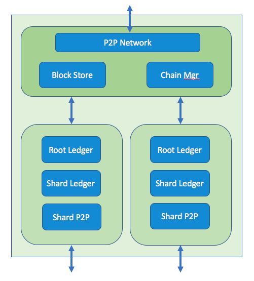

# Shard Ledgers

相对于Ontology 1.0，Ledger也需要进一步更新。

Shard中会执行root区块和shard区块，因此有root和shard两个账本。

为什么需要root账本？

* 每个shard可以有不同version／height的root账本，保证分片中的状态一致性
* 实现shard账本与root block height状态的绑定

账本模块需要新加（如果sync node 作为 root node）：

* snapshot功能，对当前ledger在新的目录下创建一个快照

root账本：

* 只需要保存 state 和 event
* 只有在执行root区块时，才可以更新root账本。其他时间，root账本为只读状态。

Shard账本：

* 需要保存block / state / event
* 执行root区块时，shard账本不可访问

## Root Node

每个分片节点的root node为shard提供如下功能：

* Node加入的shard actived时，主动启动shard node
* Node启动时，启动所有shard node
* 启动shard node时，停止当前ledger，创建当前ledger的snapshot

### Relayer Node 作为 Root Node

如果Relayer Node作为root node，在shard创建时，将无法实时通过snapshot方式启动shard节点。

* Relayer Node将只有区块relay功能，无法通过state信息 验证区块的有效性。
* shard节点首次启动时，将首先作为同步节点同步到最新区块后，才能启动shard。

## Shard Node

Shard Node初始化时，加载root ledger和shard ledger。
如果shard ledger不存在，完成shard ledger的初始化。

## ChainMgr

* ChainMgr启动时，从root ledger中加载parent shard／sib shard的信息，而不是从Root Shard Node中获取信息。
* ChainMgr处理来自shard node执行过程中的shard系统合约的notification event，不再处理root node通过event bus广播到shard的event。

